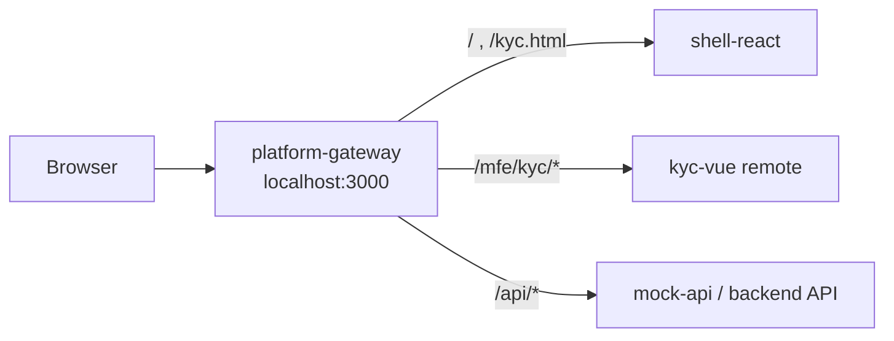
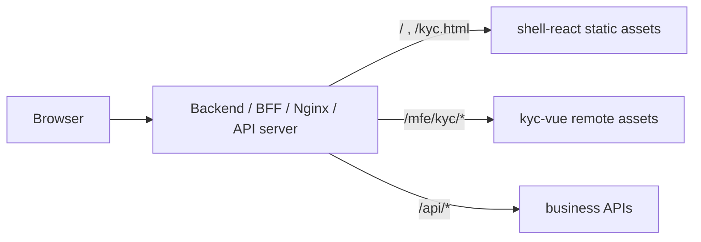

# Simple MFA MPA/Micro Frontend Sample

This repository is a learning-oriented sample that combines:

- `pnpm` workspace
- `turbo` monorepo orchestration
- a React shell
- a Vue KYC app
- a same-origin gateway
- an Express mock API

The goal is to demonstrate a structure where:

- page navigation follows an MPA style
- a domain app can still be loaded as a micro frontend
- the browser sees one main origin
- shared contracts are kept in a common package

This is an MVP, but it is intentionally close to an operational shape so the architecture is easier to understand and extend.

## 1. What This Project Demonstrates

This project is not just "multiple frontend apps in one repo".

It demonstrates a hybrid model:

- `MPA`
  - the shell owns multiple actual pages such as `/` and `/kyc.html`
  - when the user moves between those pages, the browser performs a real document navigation
- `Micro frontend composition`
  - inside the shell-owned KYC page, the shell loads a separate Vue app as a remote/custom element
- `Unified origin through a gateway`
  - instead of exposing many ports to the browser, the gateway makes the browser use one main origin

That means the user experience is:

1. Enter the shell home page.
2. The shell verifies the token.
3. Move to the KYC page as a real page transition.
4. The shell KYC page loads the Vue KYC app as a remote.
5. The KYC app talks to the API through the same origin path `/api/...`.

## 2. How To Run The Servers

### Prerequisites

- Node.js 22+
- `pnpm`

### Install

```bash
pnpm install
```

### Development mode

```bash
pnpm dev
```

Open:

- `http://localhost:3000/?token=valid-token-user-001`

Useful URLs:

- Shell home: `http://localhost:3000/`
- Shell KYC page: `http://localhost:3000/kyc.html?token=valid-token-user-001`
- KYC standalone page: `http://localhost:3000/mfe/kyc/?token=valid-token-user-001`

### Production-style local run

Build everything:

```bash
pnpm build
```

Start the mock API:

```bash
pnpm --filter @mfe/mock-api start
```

Start the production gateway:

```bash
pnpm --filter platform-gateway start
```

Then open:

- `http://localhost:3000/`

### What starts in development

When you run `pnpm dev`, Turbo starts multiple workspace processes in parallel.

Main ports:

- `3000`: gateway
- `5173`: shell React dev server
- `5174`: KYC Vue dev server
- `4175`: mock API

In practice, you should usually use only `3000` in the browser.

## 3. Architecture At A Glance

```text
Browser
  -> platform-gateway (localhost:3000)
     -> /            -> shell-react
     -> /kyc.html    -> shell-react
     -> /mfe/kyc/*   -> kyc-vue
     -> /api/*       -> mock-api
```

### Runtime flow

```text
1. User opens /
2. Gateway serves the shell home page
3. Shell reads the token from the URL
4. Shell calls /api/auth/verify
5. User navigates to /kyc.html
6. Gateway serves the shell KYC page
7. Shell loads the KYC remote entry
8. Vue app registers <mfe-kyc-app>
9. Shell renders <mfe-kyc-app token="..." api-base="/api">
10. KYC app calls /api/kyc/status and /api/kyc/complete
```

## 4. Folder Roles

### `apps/platform-gateway`

This is the main entry server for the browser.

Responsibilities:

- in development
  - proxy `/` to the shell dev server
  - proxy `/mfe/kyc` to the KYC dev server
  - proxy `/api` to the mock API
- in production
  - serve built shell files
  - serve built KYC files
  - proxy `/api` to the backend

Important file:

- [apps/platform-gateway/src/server.ts](/Users/gjm/simple-MFA/apps/platform-gateway/src/server.ts)

Why it matters:

- it hides internal ports from the browser
- it creates a same-origin environment
- it makes the development setup behave more like production

### `apps/shell-react`

This is the shell application.

Responsibilities:

- own page-level entry points
- decide navigation flow
- read URL parameters
- verify auth before handing off to domain apps
- load the KYC remote on the KYC page

Important files:

- [apps/shell-react/index.html](/Users/gjm/simple-MFA/apps/shell-react/index.html)
- [apps/shell-react/kyc.html](/Users/gjm/simple-MFA/apps/shell-react/kyc.html)
- [apps/shell-react/src/HomePage.tsx](/Users/gjm/simple-MFA/apps/shell-react/src/HomePage.tsx)
- [apps/shell-react/src/KycPage.tsx](/Users/gjm/simple-MFA/apps/shell-react/src/KycPage.tsx)
- [apps/shell-react/src/lib/runtime.ts](/Users/gjm/simple-MFA/apps/shell-react/src/lib/runtime.ts)

Why it matters:

- the shell owns page transitions
- the shell is not the owner of all business UI
- the shell is the orchestrator, not the full domain application

### `apps/kyc-vue`

This is the KYC domain app.

Responsibilities:

- render KYC UI
- call backend APIs for KYC state
- run as a standalone app
- run as a micro frontend mounted by the shell

Important files:

- [apps/kyc-vue/src/components/KycPanel.vue](/Users/gjm/simple-MFA/apps/kyc-vue/src/components/KycPanel.vue)
- [apps/kyc-vue/src/remote.ts](/Users/gjm/simple-MFA/apps/kyc-vue/src/remote.ts)
- [apps/kyc-vue/src/KycRemote.ce.vue](/Users/gjm/simple-MFA/apps/kyc-vue/src/KycRemote.ce.vue)
- [apps/kyc-vue/src/lib/runtime.ts](/Users/gjm/simple-MFA/apps/kyc-vue/src/lib/runtime.ts)

Why it matters:

- it shows that a domain app can be developed independently
- it can still be mounted inside another page when needed

Important clarification:

- `kyc-vue` is not the platform shell
- it is a domain app that can run in two modes
  - standalone mode
  - shell-mounted remote mode

It can look like a shell when opened directly at `/mfe/kyc/`, but that does not make it the platform shell.

The real shell responsibilities still belong to `shell-react`:

- owning top-level pages such as `/` and `/kyc.html`
- deciding page-to-page navigation
- loading remote apps
- handing off shared context such as token and API base

So the distinction is:

- `shell-react` = platform shell
- `kyc-vue` = KYC domain app
- `kyc-vue standalone mode` = a standalone rendering mode, not a platform shell

### `packages/mock-api`

This is a development backend simulator.

Responsibilities:

- verify tokens
- return KYC status
- toggle KYC completion state
- keep demo data in memory

Important file:

- [packages/mock-api/src/server.ts](/Users/gjm/simple-MFA/packages/mock-api/src/server.ts)

Why it matters:

- it lets frontend teams work without a real backend
- it keeps browser integration realistic by using HTTP calls

### `packages/shared-contracts`

This is the common type contract package.

Responsibilities:

- define shared types used across apps and server mocks
- prevent each app from inventing its own response shape

Important file:

- [packages/shared-contracts/src/index.ts](/Users/gjm/simple-MFA/packages/shared-contracts/src/index.ts)

Why it matters:

- it reduces mismatch between frontend boundaries
- it makes refactoring safer

## 5. The Most Important MPA Concepts

If you are new to MPA, these are the ideas to understand first.

### MPA means real page navigation

In an SPA, one HTML file is loaded first, and a client-side router changes the visible screen without fully replacing the document.

In an MPA, each route is usually backed by a real HTML document or a real server route. Moving from `/` to `/kyc.html` is a page transition, not just a React/Vue route change.

In this repository:

- `/` is the shell home page
- `/kyc.html` is the shell KYC page

That is why this project is not just a single-page shell with tabs. It is using multiple entry pages.

### A page boundary is also a memory boundary

This is one of the biggest practical differences between SPA and MPA.

When a real page transition happens:

- JavaScript memory is reset
- in-memory state is lost unless persisted elsewhere
- the new page bootstraps again

Because of that, MPA systems must rely on stable boundaries such as:

- URL parameters
- cookies/sessions
- backend API state
- storage
- shared contracts

This sample currently uses the query parameter `token` for clarity, but in a real production system that would usually move to a session or cookie-based model.

### Micro frontend is about ownership boundaries

Micro frontend does not automatically mean MPA, and MPA does not automatically mean micro frontend.

They solve different problems:

- `MPA`
  - how page navigation works
- `Micro frontend`
  - how frontend responsibilities are split between teams or domains

This repository combines both:

- the shell controls page entry and navigation
- the KYC app controls the KYC UI and domain behavior

### Same-origin is extremely important

Browsers enforce origin rules. If the shell is on one origin and the KYC app or API is on another, you start hitting integration concerns like:

- CORS
- cookie scope
- authentication forwarding
- asset path differences
- inconsistent environment behavior

That is why the gateway exists. Even though there are multiple internal servers, the browser mostly sees:

- `/`
- `/kyc.html`
- `/mfe/kyc/...`
- `/api/...`

under one main origin.

### Shell vs domain app

The shell should usually remain thin.

Good shell responsibilities:

- page routing
- shared layout
- top-level auth checks
- remote loading
- hand-off of basic context

Good domain app responsibilities:

- business-specific UI
- domain API calls
- local domain state
- domain validation and workflows

If the shell starts owning KYC logic directly, the separation becomes weaker and the architecture loses its value.

### Standalone app does not automatically mean shell

This is one of the most common sources of confusion.

`kyc-vue` can be opened directly as its own page at `/mfe/kyc/`, so it may look like a shell at first glance.

But structurally, it is still not the platform shell.

Why:

- it does not own the top-level platform routes
- it does not decide overall page navigation for the platform
- it does not orchestrate other apps
- it only owns the KYC domain UI and KYC-specific API interactions

In other words:

- a `standalone app` is an app that can run by itself
- a `shell` is the app that owns the platform entry, page composition, and high-level routing

In this repository:

- `shell-react` is the shell
- `kyc-vue` is a standalone-capable domain app

## 6. How The Shell And KYC App Are Connected

### Step 1. The shell decides where to go

The shell reads query params in [runtime.ts](/Users/gjm/simple-MFA/apps/shell-react/src/lib/runtime.ts) and decides:

- which token to use
- which API base to call
- which remote entry URL to load

### Step 2. The shell owns the KYC page

The KYC route is still a shell page:

- [kyc.html](/Users/gjm/simple-MFA/apps/shell-react/kyc.html)
- [KycPage.tsx](/Users/gjm/simple-MFA/apps/shell-react/src/KycPage.tsx)

That page is responsible for:

- loading the remote script
- rendering the custom element
- passing `token` and `api-base`

### Step 3. The KYC app exposes a remote entry

The remote entry is:

- [apps/kyc-vue/src/remote.ts](/Users/gjm/simple-MFA/apps/kyc-vue/src/remote.ts)

It registers:

- `<mfe-kyc-app>`

That means the shell does not import Vue components directly. Instead, it loads a remote entry script that defines a browser custom element.

### Step 4. The KYC app runs independently inside the shell page

The actual KYC UI lives in:

- [apps/kyc-vue/src/components/KycPanel.vue](/Users/gjm/simple-MFA/apps/kyc-vue/src/components/KycPanel.vue)

This component:

- verifies auth
- loads current KYC status
- toggles completion state

It does not depend on React memory. It only depends on:

- the token prop
- the API base prop
- the backend responses

That is exactly the kind of boundary you want in a remote domain app.

## 7. How Development And Production Differ

### In development

The gateway uses proxies:

- `/` -> shell Vite server
- `/mfe/kyc` -> KYC Vite server
- `/api` -> mock API

Benefits:

- fast local development
- HMR still works
- the browser still sees one main origin

### In production

The gateway uses built files:

- serves `apps/shell-react/dist`
- serves `apps/kyc-vue/dist`
- proxies `/api` to the backend

Benefits:

- production behavior is predictable
- asset paths are explicit
- deployment shape is clearer

## 8. What We Had To Do To Make This An MPA

This project did not become an MPA just because it has multiple apps.

The following changes are what actually made the MPA behavior real:

- split the shell into separate page entry files
  - `index.html`
  - `kyc.html`
- configure the shell build to emit both page entries
- move the KYC UI into a separate remote app
- make the shell load the remote entry script dynamically
- add a gateway so all browser calls go through one origin
- convert frontend integration to HTTP APIs instead of in-memory shared logic
- give the KYC app a real deployable base path: `/mfe/kyc/`

Without those steps, this would still just be a monorepo with multiple apps, not a meaningful MPA/MFE sample.

## 9. Things To Consider In A Real MPA

### Authentication hand-off

Current sample:

- query parameter token

Real production direction:

- session cookie
- signed hand-off token
- server-side auth validation

### Error handling

You need clear behavior for:

- remote app load failure
- API failure
- expired auth state
- version mismatch between shell and remote

This sample already has basic remote load error handling in the shell, but a production platform would likely need stronger fallback UI and logging.

### Versioning and deployment

In real systems, the shell often should not hardcode a remote file path forever.

Common production approaches:

- remote manifest file
- versioned asset folders
- rollout or canary rules

### Observability

You usually need:

- request correlation
- page-level logs
- remote load timing
- API error tracing

### Shared contract discipline

Shared contracts are useful, but only if they stay type-focused.

This repository keeps `shared-contracts` as types only, which is a good boundary. Putting business logic in shared packages often creates hidden coupling.

## 10. Platform Gateway Vs Backend-Owned Gateway

One common question is:

"If we already have a backend server, do we still need a separate `platform-gateway` app?"

The short answer is:

- not always
- but the gateway role still exists somewhere

What changes is not whether the role exists, but who owns it.

### A. Separate platform gateway in front of the apps

This is the structure used in this sample.



How to think about it:

- the browser talks to the gateway first
- the gateway decides whether the request is for shell pages, remote assets, or API calls
- the frontend platform team can own this entry layer separately from the backend

When this shape is useful:

- when backend teams do not want to manage frontend asset routing
- when frontend teams need their own platform layer
- when local development should mimic production with one visible origin
- when multiple remote apps need a dedicated frontend composition layer

Advantages:

- frontend platform concerns are clearly separated
- dev and prod behavior can be made very similar
- frontend asset routing can evolve independently of backend implementation

Trade-offs:

- one more deployable service
- one more place to configure routing and observability
- some overlap with what a BFF or edge server might already do

### B. Backend server owns the gateway role

In many real systems, the backend or BFF already plays the gateway role.



How to think about it:

- the browser still needs one entry server
- but now the backend server is also responsible for static asset serving and proxy behavior
- from the browser's point of view, it looks very similar to the separate gateway case

When this shape is useful:

- when there is already a backend entry server
- when one team wants to own all ingress and routing
- when deployment should be simpler with fewer services

Advantages:

- fewer moving parts
- fewer deployed services
- often simpler operational ownership

Trade-offs:

- backend and frontend ingress concerns become more coupled
- frontend teams may depend more on backend release/configuration processes
- local development often needs extra care to mimic production behavior

### The key insight

These two structures are conceptually closer than they look.

In both cases, someone must do the following:

- serve shell pages
- serve remote assets
- route API calls
- preserve same-origin behavior as much as possible

So the real question is not:

- "Do we need gateway behavior?"

The real question is:

- "Which layer should own gateway behavior?"

### Why this sample keeps `platform-gateway`

This repository includes [apps/platform-gateway/src/server.ts](/Users/gjm/simple-MFA/apps/platform-gateway/src/server.ts) because:

- there is no real production backend in the sample
- we wanted local development to behave like a same-origin integrated system
- it makes the architecture easier to understand in isolation

If you later introduce a real backend that can already handle:

- `/`
- `/kyc.html`
- `/mfe/kyc/*`
- `/api/*`

then the separate `platform-gateway` app may no longer be necessary.

In that situation, the backend is effectively your gateway.

### Practical decision guide

Choose a separate frontend gateway when:

- frontend composition is complex
- multiple remotes must be orchestrated by the frontend platform
- frontend teams need stronger control over ingress behavior

Let the backend own the gateway role when:

- there is already a strong BFF or edge layer
- the organization prefers a single ingress service
- static asset serving and API routing are already backend concerns

## 11. Why The Gateway Matters So Much

The gateway is easy to underestimate, but it is one of the most important parts of the architecture.

It gives you:

- one browser entrypoint
- fewer CORS problems
- more realistic local development
- a clean place for API proxying
- a clean place for production static serving

In simple terms:

- without the gateway, the browser has to understand many internal services
- with the gateway, the browser talks to one platform entrypoint

That is much closer to how real platforms are usually operated.

## 12. Suggested Reading Order For Newcomers

If you want to understand the code in the right order, read these files in sequence:

1. [apps/platform-gateway/src/server.ts](/Users/gjm/simple-MFA/apps/platform-gateway/src/server.ts)
2. [apps/shell-react/src/lib/runtime.ts](/Users/gjm/simple-MFA/apps/shell-react/src/lib/runtime.ts)
3. [apps/shell-react/src/HomePage.tsx](/Users/gjm/simple-MFA/apps/shell-react/src/HomePage.tsx)
4. [apps/shell-react/src/KycPage.tsx](/Users/gjm/simple-MFA/apps/shell-react/src/KycPage.tsx)
5. [apps/kyc-vue/src/remote.ts](/Users/gjm/simple-MFA/apps/kyc-vue/src/remote.ts)
6. [apps/kyc-vue/src/components/KycPanel.vue](/Users/gjm/simple-MFA/apps/kyc-vue/src/components/KycPanel.vue)
7. [packages/mock-api/src/server.ts](/Users/gjm/simple-MFA/packages/mock-api/src/server.ts)
8. [packages/shared-contracts/src/index.ts](/Users/gjm/simple-MFA/packages/shared-contracts/src/index.ts)

## 13. Current Limitations Of This Sample

This sample is intentionally simple.

Current simplifications:

- auth uses query token for readability
- there is only one domain app
- the backend is in-memory
- there is no remote manifest/version selection yet
- there is no SSR
- there is no real session lifecycle

That is okay. The goal here is to make the structure understandable first.

## 14. Next Natural Steps

If you want to evolve this into a more operational platform, the next steps are usually:

1. Replace query token flow with cookie/session-based auth.
2. Add a remote manifest so the shell can resolve remote versions dynamically.
3. Add health checks, logging, and fallback UI in the gateway and shell.
4. Add more domain apps under `/mfe/...`.
5. Introduce deployment/versioning rules for each remote.

## 15. Useful Commands

Install dependencies:

```bash
pnpm install
```

Run everything in development:

```bash
pnpm dev
```

Build all workspaces:

```bash
pnpm build
```

Typecheck all workspaces:

```bash
pnpm typecheck
```

Run only the gateway:

```bash
pnpm --filter platform-gateway dev
```

Run only the shell:

```bash
pnpm --filter shell-react dev
```

Run only the KYC app:

```bash
pnpm --filter kyc-vue dev
```

Run only the mock API:

```bash
pnpm --filter @mfe/mock-api dev
```

## 16. Short Summary

If you remember only one thing, remember this:

- the shell owns pages
- the KYC app owns KYC UI
- the gateway owns browser entry routing
- the API owns backend state
- shared contracts own the type boundary

That separation is the core idea behind this sample.
