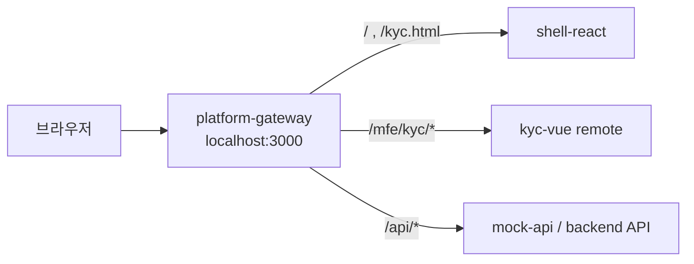
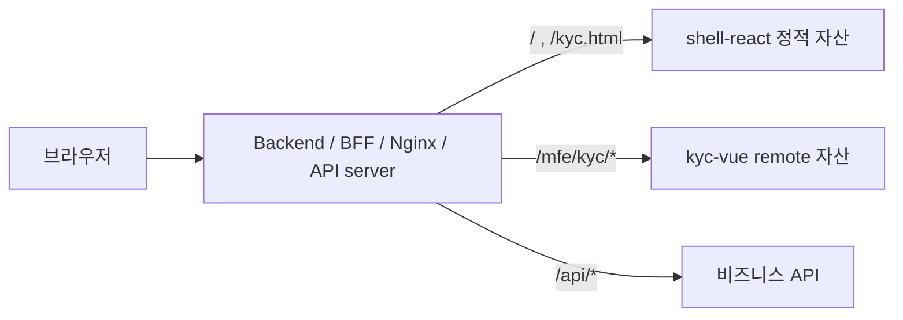

# Simple MFA MPA/마이크로 프론트엔드 샘플

이 문서는 [README.md](../README.md)의 한글 버전입니다.

이 저장소는 아래 요소를 함께 사용하는 학습용 샘플입니다.

- `pnpm` workspace
- `turbo` 기반 모노레포 orchestration
- React 셸 앱
- Vue KYC 앱
- same-origin 게이트웨이
- Express mock API

이 샘플의 목적은 다음과 같은 구조를 보여주는 것입니다.

- 페이지 이동은 `MPA` 방식으로 동작한다
- 도메인 앱은 마이크로 프론트엔드처럼 분리되어 로드될 수 있다
- 브라우저는 가능한 한 하나의 메인 origin만 본다
- 앱 간 계약은 공통 타입 패키지로 관리한다

이 프로젝트는 MVP이지만, 단순 데모를 넘어서 실제 운영형 구조로 발전시키기 쉬운 형태를 의도하고 있습니다.

## 1. 이 프로젝트가 보여주는 것

이 저장소는 단순히 "앱이 여러 개 있는 모노레포"가 아닙니다.

핵심은 `MPA + 마이크로 프론트엔드 + 게이트웨이`를 함께 보여준다는 점입니다.

- `MPA`
  - 셸이 `/`, `/kyc.html` 같은 실제 페이지를 소유합니다.
  - 사용자가 이 페이지들 사이를 이동할 때 브라우저는 실제 문서 이동을 수행합니다.
- `마이크로 프론트엔드 조합`
  - 셸이 소유한 KYC 페이지 안에서 별도의 Vue 앱을 remote/custom element로 로드합니다.
- `게이트웨이를 통한 same-origin 구성`
  - 브라우저가 여러 내부 포트를 직접 보지 않고, 하나의 메인 origin만 보도록 만듭니다.

사용자 흐름은 대략 아래와 같습니다.

1. 사용자가 셸 홈 페이지에 들어옵니다.
2. 셸이 토큰을 검증합니다.
3. 사용자가 KYC 페이지로 이동합니다.
4. 셸의 KYC 페이지가 Vue KYC 앱을 remote로 로드합니다.
5. KYC 앱은 same-origin 경로인 `/api/...`를 통해 API를 호출합니다.

## 2. 서버 구동 방법

### 사전 준비

- Node.js 22 이상
- `pnpm`

### 의존성 설치

```bash
pnpm install
```

### 개발 모드 실행

```bash
pnpm dev
```

브라우저에서 아래 주소를 열면 됩니다.

- `http://localhost:3000/?token=valid-token-user-001`

자주 쓰는 주소:

- 셸 홈: `http://localhost:3000/`
- 셸의 KYC 페이지: `http://localhost:3000/kyc.html?token=valid-token-user-001`
- KYC 단독 페이지: `http://localhost:3000/mfe/kyc/?token=valid-token-user-001`

### 운영 형태에 가까운 로컬 실행

전체 빌드:

```bash
pnpm build
```

mock API 실행:

```bash
pnpm --filter @mfe/mock-api start
```

production 게이트웨이 실행:

```bash
pnpm --filter platform-gateway start
```

그 다음 브라우저에서 아래 주소를 열면 됩니다.

- `http://localhost:3000/`

### 개발 모드에서 실제로 뜨는 서버

`pnpm dev`를 실행하면 Turbo가 여러 workspace의 프로세스를 병렬로 실행합니다.

주요 포트:

- `3000`: 게이트웨이
- `5173`: shell React dev server
- `5174`: KYC Vue dev server
- `4175`: mock API

실제로는 브라우저에서 `3000`만 사용하는 것이 일반적입니다.

## 3. 구조 한눈에 보기

```text
Browser
  -> platform-gateway (localhost:3000)
     -> /            -> shell-react
     -> /kyc.html    -> shell-react
     -> /mfe/kyc/*   -> kyc-vue
     -> /api/*       -> mock-api
```

### 런타임 흐름

```text
1. 사용자가 / 접속
2. gateway가 shell 홈 페이지를 반환
3. shell이 URL에서 token을 읽음
4. shell이 /api/auth/verify 호출
5. 사용자가 /kyc.html 로 이동
6. gateway가 shell의 KYC 페이지를 반환
7. shell이 KYC remote entry를 로드
8. Vue 앱이 <mfe-kyc-app> 등록
9. shell이 <mfe-kyc-app token="..." api-base="/api"> 렌더
10. KYC 앱이 /api/kyc/status 와 /api/kyc/complete 호출
```

## 4. 폴더별 역할

### `apps/platform-gateway`

브라우저가 가장 먼저 만나는 진입 서버입니다.

역할:

- 개발 환경
  - `/` 요청을 shell dev server로 프록시
  - `/mfe/kyc` 요청을 KYC dev server로 프록시
  - `/api` 요청을 mock API로 프록시
- 운영 환경
  - shell 빌드 결과 정적 파일 서빙
  - KYC 빌드 결과 정적 파일 서빙
  - `/api` 요청을 백엔드로 프록시

중요 파일:

- [apps/platform-gateway/src/server.ts](../apps/platform-gateway/src/server.ts)

왜 중요한가:

- 브라우저가 내부 포트를 직접 몰라도 됩니다
- same-origin 구조를 만들 수 있습니다
- 개발 환경을 운영 환경과 비슷하게 만들 수 있습니다

### `apps/shell-react`

셸 애플리케이션입니다.

역할:

- 페이지 단위 진입점 소유
- 상위 라우팅 흐름 결정
- URL 파라미터 읽기
- 도메인 앱으로 넘기기 전 인증 확인
- KYC 페이지에서 remote 앱 로드

중요 파일:

- [apps/shell-react/index.html](../apps/shell-react/index.html)
- [apps/shell-react/kyc.html](../apps/shell-react/kyc.html)
- [apps/shell-react/src/HomePage.tsx](../apps/shell-react/src/HomePage.tsx)
- [apps/shell-react/src/KycPage.tsx](../apps/shell-react/src/KycPage.tsx)
- [apps/shell-react/src/lib/runtime.ts](../apps/shell-react/src/lib/runtime.ts)

왜 중요한가:

- 페이지 전환은 셸이 소유합니다
- 모든 도메인 UI를 셸이 직접 갖고 있지는 않습니다
- 셸은 오케스트레이터이지, 모든 업무를 직접 수행하는 앱은 아닙니다

### `apps/kyc-vue`

KYC 도메인 앱입니다.

역할:

- KYC UI 렌더링
- 백엔드 API 호출
- 단독 앱으로 실행
- 셸에 마이크로 프론트엔드로 붙어서 실행

중요 파일:

- [apps/kyc-vue/src/components/KycPanel.vue](../apps/kyc-vue/src/components/KycPanel.vue)
- [apps/kyc-vue/src/remote.ts](../apps/kyc-vue/src/remote.ts)
- [apps/kyc-vue/src/KycRemote.ce.vue](../apps/kyc-vue/src/KycRemote.ce.vue)
- [apps/kyc-vue/src/lib/runtime.ts](../apps/kyc-vue/src/lib/runtime.ts)

왜 중요한가:

- 도메인 앱을 독립적으로 개발할 수 있음을 보여줍니다
- 동시에 다른 페이지 안에 붙여서 실행할 수도 있습니다

중요한 구분:

- `kyc-vue`는 플랫폼 셸이 아닙니다
- `kyc-vue`는 두 가지 모드로 실행 가능한 도메인 앱입니다
  - standalone 모드
  - shell에 붙는 remote 모드

`/mfe/kyc/`로 직접 열어 보면 셸처럼 보일 수 있지만, 그렇다고 해서 플랫폼 셸이 되는 것은 아닙니다.

실제 셸 역할은 여전히 `shell-react`가 맡습니다.

- `/`, `/kyc.html` 같은 상위 페이지 소유
- 페이지 간 이동 결정
- remote 앱 로드
- token, API base 같은 상위 컨텍스트 전달

정리하면:

- `shell-react` = 플랫폼 셸
- `kyc-vue` = KYC 도메인 앱
- `kyc-vue`의 standalone 모드 = 단독 실행 형태일 뿐, 플랫폼 셸은 아님

### `packages/mock-api`

개발용 백엔드 시뮬레이터입니다.

역할:

- 토큰 검증
- KYC 상태 조회
- KYC 완료 상태 토글
- 메모리 기반 데모 데이터 유지

중요 파일:

- [packages/mock-api/src/server.ts](../packages/mock-api/src/server.ts)

왜 중요한가:

- 실제 백엔드가 없어도 프런트 개발이 가능합니다
- 프런트가 함수 import가 아니라 HTTP를 통해 통신하도록 현실적으로 테스트할 수 있습니다

### `packages/shared-contracts`

공통 타입 계약 패키지입니다.

역할:

- 앱과 서버가 공유해야 하는 타입 정의
- 각 앱이 제각각 다른 응답 형태를 쓰지 않도록 방지

중요 파일:

- [packages/shared-contracts/src/index.ts](../packages/shared-contracts/src/index.ts)

왜 중요한가:

- 경계 간 타입 불일치를 줄여줍니다
- 리팩터링 안정성이 올라갑니다

## 5. MPA를 이해하기 위해 가장 중요한 개념

MPA를 처음 접한다면 아래 개념부터 이해하는 것이 좋습니다.

### MPA는 "실제 페이지 이동"이다

SPA에서는 보통 처음에 HTML 하나를 받고, 그 안에서 클라이언트 라우터가 화면만 바꿉니다.

MPA에서는 각 URL이 실제 HTML 문서나 서버 라우트와 연결됩니다. 즉 `/`에서 `/kyc.html`로 이동하는 것은 단순히 React/Vue 화면 전환이 아니라 "문서 자체가 바뀌는 이동"입니다.

이 저장소에서는:

- `/` = 셸 홈 페이지
- `/kyc.html` = 셸의 KYC 페이지

즉, 이 프로젝트는 단순한 SPA 라우팅이 아니라 실제 MPA 페이지 구조를 사용합니다.

### 페이지 경계는 메모리 경계이기도 하다

MPA에서 가장 중요한 실무 포인트 중 하나입니다.

실제 페이지 전환이 일어나면:

- 브라우저의 JavaScript 메모리가 초기화됩니다
- 메모리에만 있던 상태는 사라집니다
- 새 페이지가 다시 부트스트랩됩니다

그래서 MPA에서는 상태를 아래 같은 안정적인 경계로 넘겨야 합니다.

- URL 파라미터
- 쿠키/세션
- 백엔드 API 상태
- 저장소(storage)
- 공통 타입 계약

이 샘플은 설명을 쉽게 하기 위해 `token`을 query parameter로 넘기고 있지만, 실제 운영에서는 보통 세션이나 쿠키 기반으로 바꾸는 것이 맞습니다.

### 마이크로 프론트엔드는 "소유권 경계"에 관한 개념이다

마이크로 프론트엔드와 MPA는 같은 개념이 아닙니다.

둘이 해결하는 문제는 다릅니다.

- `MPA`
  - 페이지 이동을 어떻게 할 것인가
- `마이크로 프론트엔드`
  - 프런트엔드 책임을 어떤 도메인 단위로 나눌 것인가

이 저장소는 둘을 조합합니다.

- 셸이 페이지 진입과 상위 흐름을 담당
- KYC 앱이 KYC 도메인 UI와 동작을 담당

### same-origin은 매우 중요하다

브라우저는 origin을 기준으로 많은 제약을 둡니다.

셸은 한 origin, KYC 앱은 다른 origin, API는 또 다른 origin에 있으면 다음 같은 이슈가 생깁니다.

- CORS
- 쿠키 범위
- 인증 전달
- 자산 경로 문제
- 환경별 동작 불일치

그래서 게이트웨이가 필요합니다.

실제 내부 서버가 여러 개 있더라도, 브라우저 입장에서는 아래 경로가 모두 같은 origin 아래에 있는 것처럼 보입니다.

- `/`
- `/kyc.html`
- `/mfe/kyc/...`
- `/api/...`

### 셸과 도메인 앱의 책임을 분리해야 한다

셸은 가능한 한 얇게 유지하는 것이 좋습니다.

셸이 맡기 좋은 역할:

- 페이지 라우팅
- 공통 레이아웃
- 상위 인증 확인
- remote 로딩
- 기본 컨텍스트 전달

도메인 앱이 맡기 좋은 역할:

- 업무 특화 UI
- 도메인 API 호출
- 도메인 상태 관리
- 입력 검증과 워크플로

셸이 KYC 내부 업무 로직까지 직접 갖기 시작하면, 경계가 무너지고 구조의 장점이 줄어듭니다.

### standalone 앱이라고 해서 자동으로 셸이 되는 것은 아니다

처음 구조를 볼 때 가장 많이 헷갈리는 지점입니다.

`kyc-vue`는 `/mfe/kyc/`에서 단독 페이지처럼 열 수 있기 때문에, 처음 보면 셸처럼 느껴질 수 있습니다.

하지만 구조적으로는 플랫폼 셸이 아닙니다.

이유:

- 플랫폼의 최상위 라우트를 소유하지 않습니다
- 전체 페이지 이동 흐름을 결정하지 않습니다
- 다른 앱을 오케스트레이션하지 않습니다
- KYC 도메인 UI와 KYC 관련 API 상호작용만 담당합니다

즉:

- `standalone 앱` = 혼자 실행 가능한 앱
- `셸` = 플랫폼 진입점, 페이지 조합, 상위 라우팅을 소유하는 앱

이 저장소에서는:

- `shell-react`가 셸
- `kyc-vue`는 standalone 실행도 가능한 도메인 앱

## 6. 셸과 KYC 앱은 어떻게 연결되는가

### 1단계. 셸이 어디로 갈지 결정한다

셸은 [runtime.ts](../apps/shell-react/src/lib/runtime.ts)에서 query param을 읽고 다음 정보를 결정합니다.

- 어떤 token을 사용할지
- 어떤 API base를 호출할지
- 어떤 remote entry URL을 로드할지

### 2단계. KYC 페이지도 셸이 소유한다

KYC 라우트는 여전히 셸 페이지입니다.

- [kyc.html](../apps/shell-react/kyc.html)
- [KycPage.tsx](../apps/shell-react/src/KycPage.tsx)

이 페이지의 책임은:

- remote 스크립트 로드
- custom element 렌더
- `token`, `api-base` 전달

즉 "페이지"는 셸이 소유하고, "업무 UI"는 KYC 앱이 소유합니다.

### 3단계. KYC 앱이 remote entry를 노출한다

remote entry는 아래 파일입니다.

- [apps/kyc-vue/src/remote.ts](../apps/kyc-vue/src/remote.ts)

이 파일은 브라우저에 아래 custom element를 등록합니다.

- `<mfe-kyc-app>`

즉 셸은 Vue 컴포넌트를 직접 import하지 않습니다. 대신 remote entry 스크립트를 로드해서 브라우저 custom element를 등록하고, 그 태그를 사용합니다.

### 4단계. KYC 앱은 셸 안에서 독립적으로 동작한다

실제 KYC UI는 아래 파일에 있습니다.

- [apps/kyc-vue/src/components/KycPanel.vue](../apps/kyc-vue/src/components/KycPanel.vue)

이 컴포넌트는:

- auth 확인
- 현재 KYC 상태 조회
- KYC 완료 토글

을 수행합니다.

이때 React 메모리 상태에 의존하지 않고 아래 경계만 사용합니다.

- `token` prop
- `apiBase` prop
- 백엔드 응답

이런 형태가 remote 도메인 앱에 적합한 경계입니다.

## 7. 개발 환경과 운영 환경은 어떻게 다른가

### 개발 환경

게이트웨이가 프록시를 사용합니다.

- `/` -> shell Vite server
- `/mfe/kyc` -> KYC Vite server
- `/api` -> mock API

장점:

- 개발 속도가 빠릅니다
- HMR을 그대로 활용할 수 있습니다
- 브라우저는 여전히 하나의 origin만 보는 것처럼 개발할 수 있습니다

### 운영 환경

게이트웨이는 빌드된 파일을 직접 서빙합니다.

- `apps/shell-react/dist` 서빙
- `apps/kyc-vue/dist` 서빙
- `/api`는 백엔드로 프록시

장점:

- 운영 시 동작 형태가 명확합니다
- 자산 경로가 배포 경로와 일치합니다
- 배포 구조를 설명하기 쉬워집니다

## 8. 이 저장소를 MPA로 만들기 위해 실제로 한 일

이 프로젝트는 앱이 여러 개 있다고 해서 자동으로 MPA가 된 것이 아닙니다.

아래 작업이 실제로 MPA/MFE 흐름을 만든 핵심입니다.

- 셸을 여러 개의 실제 페이지 엔트리로 분리
  - `index.html`
  - `kyc.html`
- 셸 빌드가 이 페이지 엔트리를 각각 출력하도록 구성
- KYC UI를 별도 remote 앱으로 분리
- 셸이 remote entry 스크립트를 동적으로 로드하도록 구성
- 게이트웨이를 추가해 브라우저 기준 same-origin 구조로 통합
- 프런트 간 연동을 함수 import가 아니라 HTTP API 기반으로 정리
- KYC 앱의 배포 경로를 `/mfe/kyc/`로 고정

이런 단계 없이 단순히 앱을 여러 개 두는 것만으로는, 진짜 의미의 MPA/MFE 샘플이라고 보기 어렵습니다.

## 9. 실제 MPA에서 고려해야 할 점

### 인증 전달 방식

현재 샘플:

- query parameter 기반 token 전달

실제 운영 방향:

- 세션 쿠키
- signed hand-off token
- 서버 측 인증 검증

### 에러 처리

실제 서비스에서는 아래 상황에 대한 명확한 대응이 필요합니다.

- remote 앱 로드 실패
- API 실패
- 인증 만료
- shell과 remote 버전 불일치

현재 샘플도 기본적인 remote 로드 실패 처리는 하지만, 운영 수준에서는 fallback UI와 로깅이 더 강해져야 합니다.

### 버전 관리와 배포

운영 환경에서는 셸이 remote 파일 경로를 영원히 하드코딩하는 방식은 한계가 있습니다.

대표적인 방식:

- remote manifest 파일
- 버전별 자산 폴더
- canary / rollout 규칙

### 관측성(Observability)

실무에서는 보통 아래가 필요합니다.

- 요청 추적
- 페이지 단위 로그
- remote 로드 시간 측정
- API 오류 추적

### shared-contracts의 경계 유지

공유 패키지는 타입 중심으로 유지해야 좋습니다.

이 저장소는 `shared-contracts`를 타입 전용으로 유지하고 있는데, 이는 좋은 경계입니다. 반대로 공용 패키지에 비즈니스 로직이 들어가기 시작하면 숨은 결합도가 높아질 수 있습니다.

## 10. platform-gateway가 있는 구조 vs 백엔드가 gateway 역할을 대신하는 구조

자주 나오는 질문이 있습니다.

"이미 별도의 백엔드 서버가 있다면, `platform-gateway`가 꼭 필요할까?"

짧게 답하면:

- 항상 필요한 것은 아닙니다
- 하지만 gateway 역할 자체는 어디에선가 반드시 존재합니다

즉, 중요한 것은 "gateway가 필요하냐"가 아니라 "그 역할을 누가 맡느냐"입니다.

### A. 별도의 platform gateway가 앞단에 있는 구조

이 저장소가 현재 사용하는 구조입니다.



이 구조를 이해하는 방법:

- 브라우저는 항상 gateway를 먼저 호출합니다
- gateway가 이 요청이 shell 페이지인지, remote 자산인지, API인지 구분합니다
- 프런트 플랫폼 계층을 백엔드와 별도로 둘 수 있습니다

이 구조가 유용한 경우:

- 백엔드 팀이 프런트 자산 라우팅까지 맡고 싶지 않을 때
- 프런트 플랫폼 팀이 별도 ingress 계층을 운영하고 싶을 때
- 로컬 개발 환경을 one-origin 구조로 운영에 가깝게 만들고 싶을 때
- 여러 remote 앱을 프런트 레벨에서 조합해야 할 때

장점:

- 프런트 플랫폼 관심사를 명확하게 분리할 수 있습니다
- 개발 환경과 운영 환경을 비슷하게 만들 수 있습니다
- 프런트 자산 라우팅을 백엔드 구현과 독립적으로 진화시킬 수 있습니다

트레이드오프:

- 배포해야 할 서비스가 하나 더 생깁니다
- 라우팅과 관측성 설정 지점이 하나 더 생깁니다
- BFF나 edge 서버와 일부 역할이 겹칠 수 있습니다

### B. 백엔드 서버가 gateway 역할까지 맡는 구조

실제 서비스에서는 backend, BFF, Nginx, API server가 이 역할을 동시에 수행하는 경우가 많습니다.



이 구조를 이해하는 방법:

- 브라우저 입장에서는 여전히 하나의 진입 서버가 필요합니다
- 다만 그 진입 서버가 별도 `platform-gateway`가 아니라 백엔드인 것입니다
- 브라우저 관점에서 보면 두 구조는 상당히 비슷합니다

이 구조가 유용한 경우:

- 이미 강한 BFF나 edge 계층이 있을 때
- ingress와 라우팅을 하나의 팀이 관리하고 싶을 때
- 배포 서비스 수를 줄이고 싶을 때

장점:

- 움직이는 부품 수가 줄어듭니다
- 배포 서비스가 줄어듭니다
- 운영 소유권이 단순해지는 경우가 많습니다

트레이드오프:

- 백엔드와 프런트 ingress 관심사가 더 강하게 결합됩니다
- 프런트 팀이 배포/설정 변경에서 백엔드 프로세스에 더 의존할 수 있습니다
- 로컬 개발 환경을 운영과 비슷하게 맞추기가 더 까다로울 수 있습니다

### 핵심 정리

이 두 구조는 생각보다 훨씬 비슷합니다.

두 경우 모두 누군가는 반드시 아래 역할을 해야 합니다.

- shell 페이지 서빙
- remote 자산 서빙
- API 라우팅
- same-origin 동작 유지

그래서 진짜 질문은:

- "gateway 동작이 필요한가?"

가 아니라

- "gateway 동작을 어느 계층이 맡을 것인가?"

입니다.

### 이 샘플이 `platform-gateway`를 유지하는 이유

이 저장소가 [apps/platform-gateway/src/server.ts](../apps/platform-gateway/src/server.ts)를 별도로 두는 이유는:

- 실제 운영 백엔드가 없는 샘플이기 때문이고
- 로컬 개발도 same-origin 구조처럼 보이게 만들기 위함이며
- 구조를 독립적으로 이해하기 쉽게 하기 위해서입니다

나중에 실제 백엔드가 아래 경로를 모두 자연스럽게 처리할 수 있다면:

- `/`
- `/kyc.html`
- `/mfe/kyc/*`
- `/api/*`

별도의 `platform-gateway` 앱은 더 이상 필요하지 않을 수 있습니다.

그 경우에는 백엔드가 사실상 gateway 역할을 하는 것입니다.

### 실무 판단 기준

별도의 프런트 gateway가 좋은 경우:

- 프런트 조합 로직이 복잡할 때
- 여러 remote를 프런트 플랫폼이 직접 오케스트레이션해야 할 때
- 프런트 팀이 ingress 레이어를 더 강하게 통제해야 할 때

백엔드가 gateway 역할을 맡는 것이 좋은 경우:

- 이미 강한 BFF/edge 계층이 있을 때
- 조직이 단일 ingress 서비스를 선호할 때
- 정적 자산 서빙과 API 라우팅이 원래부터 백엔드 책임일 때

## 11. 왜 gateway가 그렇게 중요한가

gateway는 생각보다 훨씬 중요합니다.

gateway가 있으면:

- 브라우저 진입점이 하나가 됩니다
- CORS 문제가 줄어듭니다
- 로컬 개발이 더 운영처럼 보입니다
- API 프록시 위치가 명확해집니다
- production 정적 자산 서빙 위치가 명확해집니다

간단히 말하면:

- gateway가 없으면 브라우저가 내부 서비스 구조를 더 많이 알아야 합니다
- gateway가 있으면 브라우저는 하나의 플랫폼 진입점만 알면 됩니다

이것이 실제 운영형 플랫폼 구조와 훨씬 가깝습니다.

## 12. 처음 읽는 사람을 위한 추천 코드 읽기 순서

구조를 빠르게 이해하려면 아래 순서로 읽는 것을 추천합니다.

1. [apps/platform-gateway/src/server.ts](../apps/platform-gateway/src/server.ts)
2. [apps/shell-react/src/lib/runtime.ts](../apps/shell-react/src/lib/runtime.ts)
3. [apps/shell-react/src/HomePage.tsx](../apps/shell-react/src/HomePage.tsx)
4. [apps/shell-react/src/KycPage.tsx](../apps/shell-react/src/KycPage.tsx)
5. [apps/kyc-vue/src/remote.ts](../apps/kyc-vue/src/remote.ts)
6. [apps/kyc-vue/src/components/KycPanel.vue](../apps/kyc-vue/src/components/KycPanel.vue)
7. [packages/mock-api/src/server.ts](../packages/mock-api/src/server.ts)
8. [packages/shared-contracts/src/index.ts](../packages/shared-contracts/src/index.ts)

## 13. 현재 샘플의 한계

이 샘플은 의도적으로 단순화되어 있습니다.

현재 단순화된 점:

- 인증이 query token 기반입니다
- 도메인 앱이 하나뿐입니다
- 백엔드가 메모리 기반입니다
- remote manifest / 버전 선택 구조가 아직 없습니다
- SSR은 없습니다
- 실제 세션 라이프사이클은 없습니다

괜찮습니다. 이 샘플의 목적은 먼저 구조를 이해하기 쉽게 만드는 것입니다.

## 14. 다음 자연스러운 확장 단계

이 구조를 운영형 플랫폼으로 더 발전시키고 싶다면 보통 아래 순서로 갑니다.

1. query token 흐름을 세션/쿠키 기반 인증으로 교체
2. shell이 remote 버전을 동적으로 결정할 수 있도록 remote manifest 추가
3. gateway와 shell에 health check, 로깅, fallback UI 추가
4. `/mfe/...` 아래에 더 많은 도메인 앱 추가
5. 각 remote의 배포/버전 관리 규칙 도입

## 15. 유용한 명령어

의존성 설치:

```bash
pnpm install
```

전체 개발 서버 실행:

```bash
pnpm dev
```

전체 빌드:

```bash
pnpm build
```

전체 타입체크:

```bash
pnpm typecheck
```

gateway만 실행:

```bash
pnpm --filter platform-gateway dev
```

shell만 실행:

```bash
pnpm --filter shell-react dev
```

KYC 앱만 실행:

```bash
pnpm --filter kyc-vue dev
```

mock API만 실행:

```bash
pnpm --filter @mfe/mock-api dev
```

## 16. 짧은 요약

이 프로젝트를 한 줄로 요약하면 다음과 같습니다.

- 셸은 페이지를 소유합니다
- KYC 앱은 KYC UI를 소유합니다
- gateway는 브라우저 진입 라우팅을 소유합니다
- API는 백엔드 상태를 소유합니다
- shared contracts는 타입 경계를 소유합니다

이 분리가 이 샘플 구조의 핵심입니다.


추가 문서:

- [셸이 앱을 붙이는 방식 설명서](./mfe-shell-app-composition.md)
  - 현재 코드의 `customElements` 기반 조합 방식 설명
  - `mount()` API, Module Federation, iframe, MPA route handoff 방식 비교